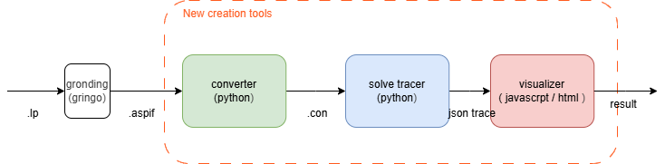
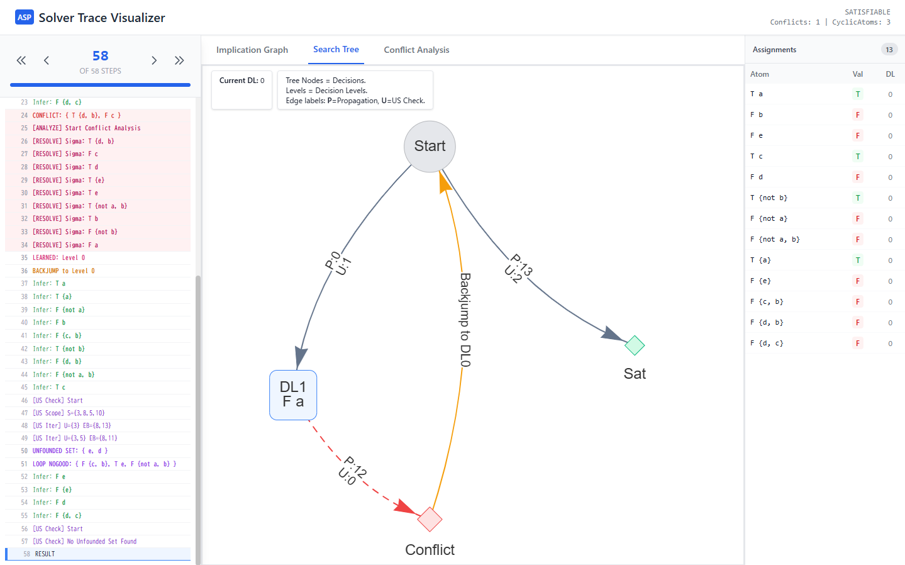

# ViSTA (Visualization of Solving Trace for ASP)

ViSTA is a toolset for tracing and visualizing the solving process of Answer Set Programming (ASP) programs.

ASP is a declarative programming paradigm used for knowledge representation and combinatorial problem solving. Modern ASP solvers use a CDNL (Conflict-Driven Nogood Learning) algorithm — similar to CDCL in SAT solving — to search for answer sets. ViSTA lets you step through that internal solving process visually, making it useful for understanding, debugging, and educational purposes.

## Overview



The pipeline consists of three stages:
1. **Grounding** — `gringo` converts a high-level `.lp` program into a flat `.aspif` format.
2. **Conversion** — `converter.py` normalizes weighted/cardinality rules into plain rules (`.con` format).
3. **Tracing** — `cdnl-tracer.py` executes the CDNL search and records each solving event as a JSON trace.
4. **Visualization** — The web-based visualizer renders the trace interactively.

## Visualizer



The online visualizer is available at: https://tomoyay1622.github.io/ViSTA/

## Getting Started

### Requirements
- Python 3.8+
- [gringo / clingo](https://potassco.org/clingo/) (for grounding `.lp` files)
- A modern web browser

### Installation

Clone this repository:

```sh
$ git clone https://github.com/tomoyay1622/ViSTA.git
$ cd ViSTA
```

No additional Python packages are required.

### How to Use

**Step 1.** Ground the ASP program with `gringo`:

```sh
$ gringo example/test.lp > example/test.aspif
```

**Step 2.** Normalize rules with `converter.py` (converts weighted/cardinality rules into plain rules):

```sh
$ python3 converter.py example/test.aspif > example/test.con
```

**Step 3.** Run the CDNL tracer to obtain a solving trace in JSON format:

```sh
$ python3 cdnl-tracer.py example/test.con > example/test.json
```

**Step 4.** Open the [online visualizer](https://tomoyay1622.github.io/ViSTA/) and paste the contents of `example/test.json` to explore the trace interactively.

